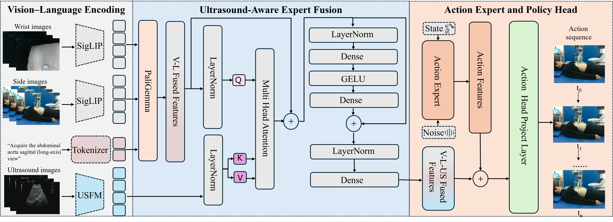

<div align="center">

# US-VLA: An Ultrasound Vision-Language-Action Model for Embodied Abdominal Scanning

**Accepted to ACM MM 2026**

</div>

---

## Overview

**US-VLA** is one of the first **vision–language–action (VLA)** frameworks tailored for **automated abdominal ultrasound scanning**. It explicitly encodes clinical semantic goals and generates sequential probe-manipulation actions under **real-time ultrasound feedback**.

Unlike conventional reinforcement-learning or imitation-based ultrasound automation that relies on hand-crafted reward functions or low-level motion supervision, US-VLA augments a pre-trained vision–language model with a dedicated **ultrasound image encoder** and an **ultrasound-aware expert fusion module**. This injects task-relevant ultrasound semantics into the action-generation pathway, enabling closed-loop and standardized acquisition of clinically meaningful standard planes with improved stability and generalization across organs, scanning targets, and diverse clinical conditions.

To support this task, we further construct **US-VLA-Data**, a real-world dataset covering liver and kidney examinations with five clinically defined standard planes, comprising **320 expert scanning trajectories** and approximately **80,000 synchronized timesteps**.

---

## Framework

<div align="center">
  
</div>

The framework consists of three main components:

- **(1) Vision–Language Encoding.** RGB images from the wrist-mounted and side-view cameras are encoded by a **SigLIP** visual encoder, and clinical task instructions describing the target standard plane are tokenized and embedded by a language encoder. Ultrasound images are encoded separately by a universal **US foundation model (USFM)** to avoid the domain mismatch between natural and ultrasound images. A **PaliGemma** backbone aligns the visual and language streams into fused vision–language representations.

- **(2) Ultrasound-Aware Expert Fusion.** A cross-modal attention module injects real-time ultrasound feedback into the decision process: the vision–language features serve as **queries** while the ultrasound features serve as **keys/values**, followed by residual connections and a feed-forward expert block that produces ultrasound-modulated action features.

- **(3) Action Expert and Policy Head.** Conditioned on the fused representations and the robot state, an action expert and policy head map the features to **continuous, sequential probe-control commands** under closed-loop ultrasound guidance.

---

## Repository Structure

This codebase is built on [openpi](https://github.com/Physical-Intelligence/openpi) (based on commit `15a9616`). The US-VLA additions are:

| Path | Description |
|---|---|
| `src/openpi/models/usfm_encoder.py` | JAX/Flax USFM encoder (ViT-B/16), compatible with the official PyTorch weights |
| `src/openpi/models/ultrasound_fusion.py` | Cross-attention based ultrasound-aware expert fusion module |
| `src/openpi/policies/ur_policy.py` | Input/output transforms for the UR robot with three camera views |
| `src/openpi/models/pi0.py`, `pi0_config.py` | USFM encoding branch and fusion injection into the action pathway |
| `src/openpi/training/weight_loaders.py` | USFM pretrained weight loading (PyTorch → Flax conversion) |
| `src/openpi/training/config.py` | US-VLA training configs (`pi05_ur_usfm_fusion` and baselines/ablations) |

---

## Installation

We use [uv](https://docs.astral.sh/uv/) to manage the Python environment (same as openpi):

```bash
git clone https://github.com/VMVLab/US-VLA.git
cd US-VLA
GIT_LFS_SKIP_SMUDGE=1 uv sync
```

An NVIDIA GPU with at least 24 GB of VRAM is recommended for LoRA fine-tuning.

## USFM Pretrained Weights

US-VLA uses the [USFM](https://github.com/openmedlab/USFM) ultrasound foundation model as the ultrasound image encoder. Download `USFM_latest.pth` following the instructions in the USFM repository (a Google Drive link is provided in its README), and place it at:

```
./checkpoints/usfm/USFM_latest.pth
```

The training configs load USFM weights from this path (see `usfm_weights_path` in `src/openpi/training/config.py`). The pi0/pi05 base checkpoints are downloaded automatically from `gs://openpi-assets`.

## Data

Training expects a [LeRobot](https://github.com/huggingface/lerobot) format dataset with the following fields per timestep:

- `state`: 6-D TCP pose `[x, y, z, rx, ry, rz]`
- `actions`: 6-D absolute TCP pose targets (chunked to an action horizon of 50)
- `base_rgb`: side-view camera image (224x224x3)
- `wrist_rgb`: wrist-mounted camera image (224x224x3)
- `ultrasound_rgb`: ultrasound image (224x224x3)
- `prompt`: task instruction describing the target standard plane (e.g., "scan the left liver standard plane")

Replace `your_hf_username/us_vla_data` in `src/openpi/training/config.py` with your own dataset repo id.

Ultrasound images are preprocessed with center cropping and CLAHE contrast enhancement (see `_process_ultrasound_image` in `src/openpi/transforms.py`).

## Training

First compute the normalization statistics for your dataset:

```bash
uv run scripts/compute_norm_stats.py --config-name pi05_ur_usfm_fusion
```

Then launch training (US-VLA full model):

```bash
XLA_PYTHON_CLIENT_MEM_FRACTION=0.9 uv run scripts/train.py pi05_ur_usfm_fusion \
    --exp-name=us_vla_experiment \
    --overwrite
```

### Available configs

| Config | Base | Ultrasound input | USFM encoder | Expert fusion |
|---|---|---|---|---|
| `pi0_ur_wus` | pi0 | - | - | - |
| `pi0_ur_us` | pi0 | SigLIP | - | - |
| `pi05_ur_wus` | pi05 | - | - | - |
| `pi05_ur_us` | pi05 | SigLIP | - | - |
| `pi05_ur_usfm` | pi05 | USFM | yes | - |
| `pi05_ur_usfm_fusion` (**Ours**) | pi05 | USFM | yes | yes |

All configs use LoRA fine-tuning (`gemma_2b_lora` + `gemma_300m_lora`) on top of the corresponding openpi base checkpoints.

## Inference

Serve a trained policy over WebSocket:

```bash
uv run scripts/serve_policy.py policy:checkpoint \
    --policy.config=pi05_ur_usfm_fusion \
    --policy.dir=./checkpoints/pi05_ur_usfm_fusion/us_vla_experiment/29999
```

Query the policy from a client using `openpi-client`:

```python
from openpi_client import websocket_client_policy

policy = websocket_client_policy.WebsocketClientPolicy(host="localhost", port=8000)
action_chunk = policy.infer({
    "state": state,                      # (6,) TCP pose
    "images": {
        "side_camera": side_image,       # (224, 224, 3) uint8
        "wrist_camera": wrist_image,     # (224, 224, 3) uint8
        "ultrasound_camera": us_image,   # (224, 224, 3) uint8
    },
    "prompt": "scan the left liver standard plane",
})["actions"]
```

Robot deployment is hardware-specific and is not included in this repository. To run on a real robot, implement an environment loop that captures the three camera streams, queries the policy server, and executes the returned action chunks on your robot controller.

## Citation

If you find US-VLA useful, please cite:

```bibtex
@inproceedings{usvla2026,
  title     = {US-VLA: An Ultrasound Vision-Language-Action Model for Embodied Abdominal Scanning},
  booktitle = {Proceedings of the 34th ACM International Conference on Multimedia (ACM MM)},
  year      = {2026},
}
```

## Acknowledgements

- [openpi](https://github.com/Physical-Intelligence/openpi): this codebase is built on the openpi implementation of pi0/pi05 (commit `15a9616`).
- [USFM](https://github.com/openmedlab/USFM): the ultrasound foundation model used as the ultrasound image encoder.
- [LeRobot](https://github.com/huggingface/lerobot): dataset format and data loading.
